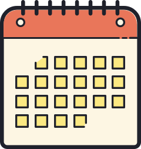

# Outline {#outline .unnumbered}

{.cover width="100" height="100"} We have 4 hours total together, spread across two 2-hour sessions on two consecutive days.

You've been assigned to one of the two following cohorts to attend both days:

-   Cohort A: 1pm-3pm ET
-   Cohort B: 8am-10am ET

The plan for the two days are as follows.
All times shown are in ET.

## Day one {.unnumbered}

+---------------+-------------------------------------------------------+
| Time          | Module                                                |
+===============+=======================================================+
| 08:00 - 08:15 | Introduction                                          |
+---------------+-------------------------------------------------------+
| 08:15 - 08:55 | Let them eat cake first!                              |
+---------------+-------------------------------------------------------+
|               | Cherish day one                                       |
+---------------+-------------------------------------------------------+
| 08:55 - 09:05 | ☕ Break                                               |
+---------------+-------------------------------------------------------+
| 09:05 - 10:00 | Live code, early and often                            |
+---------------+-------------------------------------------------------+
|               | Define and pronounce                                  |
+---------------+-------------------------------------------------------+

## Day two {.unnumbered}

+---------------+-------------------------------------------------------+
| Time          | Module                                                |
+===============+=======================================================+
| 08:00 - 08:10 | Recap                                                 |
+---------------+-------------------------------------------------------+
| 08:10 - 08:55 | Provide feedback, instantly                           |
+---------------+-------------------------------------------------------+
|               | Leverage visuals                                      |
+---------------+-------------------------------------------------------+
|               | Help with finding help                                |
+---------------+-------------------------------------------------------+
| 08:55 - 09:05 | ☕ Break                                               |
+---------------+-------------------------------------------------------+
| 09:05 - 10:00 | Highlight diversity                                   |
+---------------+-------------------------------------------------------+
|               | Make room for creativity                              |
+---------------+-------------------------------------------------------+
|               | Optimize discoverability                              |
+---------------+-------------------------------------------------------+
