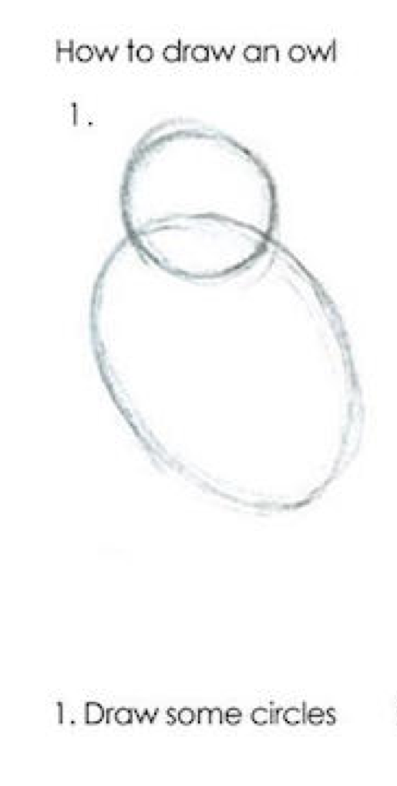
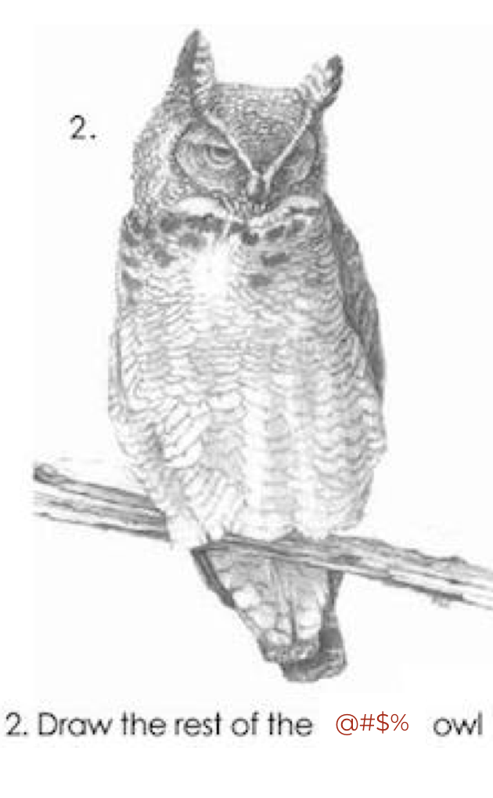

```{r child = "../setup.Rmd"}
```

```{r load-packages, message = FALSE, echo = FALSE}
library(magick)
library(tidyverse)
library(unvotes)
library(lubridate)
library(scales)
```

class: inverse, middle

# Let's start with a question...

---

class: middle, inverse

## How do you prefer your cake recipes? Words only, or words & pictures?

.pull-left[
```{r recipe-picture, echo=FALSE}
knitr::include_graphics("images/recipe-picture.png")
```
]
.pull-right[
```{r recipe-words, echo=FALSE}
knitr::include_graphics("images/recipe-words.png")
```
]

---

class: middle, inverse

## How do you prefer your cake recipes? Words only, or words & pictures?

.pull-left[
```{r recipe-picture-selected, echo=FALSE, cache=TRUE}
image_read("images/recipe-picture.png") %>%
  image_border("#F5B895", "50x50") %>%
  image_annotate("\u2665", size = 300, gravity = "SouthEast", color = "#F5B895", location = "+100+50")
```
]
.pull-right[
```{r recipe-words-xed, echo=FALSE, cache=TRUE}
image_read("images/recipe-words.png") %>%
  image_annotate("X", size = 1200, gravity = "Center", color = "#638CC7")
```
]

---

.pull-left[
```{r recipe-picture-small, echo=FALSE, out.height=150, out.width=250, fig.align="center"}
knitr::include_graphics("images/recipe-picture.png")
```
- Open today's demo project
- Knit the document and discuss the visualisation you made with your neighbor
- Then, change `Turkey` to a different country, and plot again
]
.pull-right[
```{r recipe-words-small, echo=FALSE, out.height=150, out.width=250, fig.align="center"}
knitr::include_graphics("images/recipe-words.png")
```
.small[
```{r recipe-words-code}
x <- 8
y <- "monkey"
z <- FALSE

class(x)
class(y)
class(z)
```
]
]

---

class: middle

## .hand[ with with great examples, ]
## .hand[ comes a great amount of code... ]

---

class: middle

## .hand[ but let’s focus on the task at hand... ]

- Open today's demo project
- Knit the document and discuss the visualisation you made with your neighbor
- Then, **.pink[ change `Turkey` to a different country, and plot again]**

---

.midi[
```{r unvotes-code-1, eval=FALSE}
un_votes %>%
  mutate(country = case_when(
    country == "United Kingdom of Great Britain and Northern Ireland" ~ "UK & NI",
    country == "United States of America" ~ "US",
    TRUE ~ country
    )
  ) %>%
  inner_join(un_roll_calls, by = "rcid") %>%
  inner_join(un_roll_call_issues, by = "rcid") %>%
  filter(country %in% c("UK & NI", "US", "Turkey")) %>%
  mutate(year = year(date)) %>%
  group_by(country, year, issue) %>%
  summarize(percent_yes = mean(vote == "yes")) %>%
  ggplot(mapping = aes(x = year, y = percent_yes, color = country)) +
  geom_point(alpha = 0.4) +
  geom_smooth(method = "loess", se = FALSE) +
  facet_wrap(~issue) +
  scale_y_continuous(labels = percent) +
  labs(
    title = "Percentage of 'Yes' votes in the UN General Assembly",
    subtitle = "1946 to 2015",
    y = "% Yes", x = "Year", color = "Country"
  )
```
]

---

.midi[
```{r unvotes-code-2, eval=FALSE}
un_votes %>%
  mutate(country = case_when(
    country == "United Kingdom of Great Britain and Northern Ireland" ~ "UK & NI",
    country == "United States of America" ~ "US",
    TRUE ~ country
    )
  ) %>%
  inner_join(un_roll_calls, by = "rcid") %>%
  inner_join(un_roll_call_issues, by = "rcid") %>%
  filter(country %in% c("UK & NI", "US", "Turkey")) %>% #<<
  mutate(year = year(date)) %>%
  group_by(country, year, issue) %>%
  summarize(percent_yes = mean(vote == "yes")) %>%
  ggplot(mapping = aes(x = year, y = percent_yes, color = country)) +
  geom_point(alpha = 0.4) +
  geom_smooth(method = "loess", se = FALSE) +
  facet_wrap(~issue) +
  scale_y_continuous(labels = percent) +
  labs(
    title = "Percentage of 'Yes' votes in the UN General Assembly",
    subtitle = "1946 to 2015",
    y = "% Yes", x = "Year", color = "Country"
  )
```
]

---

.midi[
```{r unvotes-code-3, eval=FALSE}
un_votes %>%
  mutate(country = case_when(
    country == "United Kingdom of Great Britain and Northern Ireland" ~ "UK & NI",
    country == "United States of America" ~ "US",
    TRUE ~ country
    )
  ) %>%
  inner_join(un_roll_calls, by = "rcid") %>%
  inner_join(un_roll_call_issues, by = "rcid") %>%
  filter(country %in% c("UK & NI", "US", "France")) %>% #<<
  mutate(year = year(date)) %>%
  group_by(country, year, issue) %>%
  summarize(percent_yes = mean(vote == "yes")) %>%
  ggplot(mapping = aes(x = year, y = percent_yes, color = country)) +
  geom_point(alpha = 0.4) +
  geom_smooth(method = "loess", se = FALSE) +
  facet_wrap(~issue) +
  scale_y_continuous(labels = percent) +
  labs(
    title = "Percentage of 'Yes' votes in the UN General Assembly",
    subtitle = "1946 to 2015",
    y = "% Yes", x = "Year", color = "Country"
  )
```
]

---

class: inverse, middle

# Your turn

---

class: inverse, middle

# Back to the main course

---

class: middle

## .hand[ non-trivial examples can be motivating, ]
## .hand[ but need to avoid ] `r emo::ji("point_down")`

.pull-left[
```{r owl-1, echo=FALSE, fig.align="right", out.height=390, out.width=250}

```
]
.pull-right[
```{r owl-2, echo=FALSE, fig.align="left", out.height=390, out.width=250}

```
]

---

class: middle

.center[
.three-column[
```{r ref.label="owl-1", echo=FALSE, out.height=400, out.width=250}
```
]
.three-column[
## .center[ .hand[ scaffold + layer ] ]
]
.three-column[
```{r ref.label="owl-2", echo=FALSE, out.height=400, out.width=250}
```
]
]

---

```{r echo=FALSE}
un_uk_us_tr <- un_votes %>%
  mutate(
    country = case_when(
      country == "United Kingdom of Great Britain and Northern Ireland" ~ "UK & NI",
      country == "United States of America" ~ "US",
      TRUE ~ country
    )
  ) %>%
  inner_join(un_roll_calls, by = "rcid") %>%
  inner_join(un_roll_call_issues, by = "rcid") %>%
  mutate(
    issue = if_else(issue == "Nuclear weapons and nuclear material", 
                    "Nuclear weapons and material", 
                    issue)
  ) %>%
  filter(country %in% c("UK & NI", "US", "Turkey")) %>%
  mutate(year = year(date)) %>%
  group_by(country, year, issue) %>%
  summarize(percent_yes = mean(vote == "yes"))
```

.small[
```{r out.width = "80%", fig.asp = 0.45, fig.width = 10}
ggplot(un_uk_us_tr) #<<
```
]

---

.small[
```{r out.width = "80%", fig.asp = 0.45, fig.width = 10}
ggplot(un_uk_us_tr,
       aes(x = year, y = percent_yes)) #<<
```
]

---

.small[
```{r out.width = "80%", fig.asp = 0.45, fig.width = 10}
ggplot(un_uk_us_tr,
       aes(x = year, y = percent_yes)) +
  geom_point() #<<
```
]

---

.small[
```{r out.width = "80%", fig.asp = 0.45, fig.width = 10}
ggplot(un_uk_us_tr,
       aes(x = year, y = percent_yes)) +
  geom_point() +
  facet_wrap(~issue) #<<
```
]

---

.small[
```{r out.width = "80%", fig.asp = 0.45, fig.width = 10}
ggplot(un_uk_us_tr,
       aes(x = year, y = percent_yes, color = country)) + #<<
  geom_point() +
  facet_wrap(~issue)
```
]

---

.small[
```{r out.width = "80%", fig.asp = 0.45, fig.width = 10}
ggplot(un_uk_us_tr,
       aes(x = year, y = percent_yes, color = country)) +
  geom_point(alpha = 0.4) + #<<
  facet_wrap(~issue)
```
]

---

.small[
```{r out.width = "80%", fig.asp = 0.45, fig.width = 10}
ggplot(un_uk_us_tr,
       aes(x = year, y = percent_yes, color = country)) +
  geom_point(alpha = 0.4) +
  geom_smooth(method = "loess", se = FALSE) + #<<
  facet_wrap(~issue) 
```
]

---

.small[
```{r out.width = "80%", fig.asp = 0.45, fig.width = 10}
ggplot(un_uk_us_tr,
       aes(x = year, y = percent_yes, color = country)) +
  geom_point(alpha = 0.4) +
  geom_smooth(method = "loess", se = FALSE) +
  facet_wrap(~issue) +
  labs( #<<
    title = "Percentage of 'Yes' votes in the UN General Assembly", #<<
    subtitle = "1946 to 2015", #<<
    y = "% Yes", x = "Year", color = "Country" #<<
  ) #<<
```
]

---

.small[
```{r out.width = "80%", fig.asp = 0.45, fig.width = 10}
ggplot(un_uk_us_tr, 
       aes(x = year, y = percent_yes, color = country)) +
  geom_point(alpha = 0.4) +
  geom_smooth(method = "loess", se = FALSE) +
  facet_wrap(~issue) +
  labs(
    title = "Percentage of 'Yes' votes in the UN General Assembly",
    subtitle = "1946 to 2015",
    y = "% Yes", x = "Year", color = "Country"
  ) +
  scale_y_continuous(labels = label_percent()) #<<
```
]
