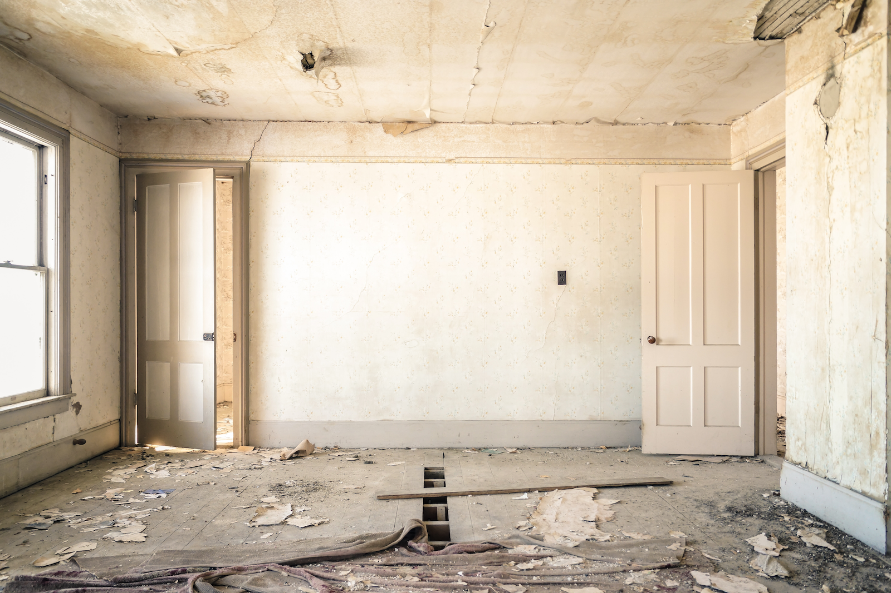

```{r child = "../setup.Rmd"}
```

```{r load-packages, message = FALSE, echo = FALSE}
library(magick)
library(tidyverse)
```

class: inverse, middle

# Let's start with another question...

---

class: middle, inverse

## Which kitchen would you rather bake in? 

.pull-left[
```{r kitchen-inrepair, echo=FALSE}

```
]
.pull-right[
```{r kitchen-built, echo=FALSE}
knitr::include_graphics("images/kitchen-built.png")
```
]

---

class: middle, inverse

## Which kitchen would you rather bake in?

.pull-left[
```{r kitchen-inrepair-xed, echo=FALSE, cache=TRUE}
image_read("images/kitchen-inrepair.png") %>%
  image_annotate("X", size = 1200, gravity = "Center", color = "#638CC7")
```
]
.pull-right[
```{r kitchen-built-selected, echo=FALSE, cache=TRUE}
image_read("images/kitchen-built.png") %>% 
  image_border("#F5B895", "50x50") %>%
  image_annotate("\u2665", size = 300, gravity = "SouthEast", color = "#F5B895", location = "+100+50")
```
]

---

.pull-left[
```{r kitchen-inrepair-small, echo=FALSE, out.height=250}

```
- Install R
- Install RStudio
- Install the following packages:
  - tidyverse
  - rmarkdown
  - ...
- Load these packages
- Install git
]
.pull-right[
```{r kitchen-built-small, echo=FALSE, out.height=250}
knitr::include_graphics("images/kitchen-built.png")
```
- Go to rstudio.cloud (or some other server based solution)
- Log in with your ID & pass
```{r hello-R, eval=FALSE}
> hello R!
```
]

---

class: inverse, middle

# Hello RStudio Cloud!

---

## What is RStudio Cloud?

.pull-left-narrow[
```{r echo=FALSE}
knitr::include_graphics("images/cloud.png")
```
]
.pull-right-wide[
.large[We created **RStudio Cloud** to make it easy for professionals, hobbyists, trainers, teachers, and students to do, share, teach, and learn data science using R.]
]

---

```{r echo=FALSE, out.width = "75%"}
knitr::include_graphics("images/rstudio-ide.png")
```

---

```{r echo=FALSE, out.width = "75%"}
knitr::include_graphics("images/rstudio-cloud.png")
```

---

## Why RStudio Cloud?

- Does not require IT support
- Features designed for instructors:
  - Classes can be organized in workspaces
  - Members can be assigned different roles: instructor, TA, student
  - Projects can be public or private
  - Projects can be made into assignments 
  - Students can make copies of projects created by instructor
  - Instructor can peek into student projects
  - A base project template can ensure same packages in each new project created in the workspace
  - Git works out of the box

---

class: inverse, middle

# Context 1: You're sharing a project

.hand[at a meetup talk, conference presentation, teaching a class, etc.]

---

class: middle

.larger[
`r emo::ji("woman_teacher")` presenter (teacher)
]
.larger[
`r emo::ji("woman_technologist")` audience (student)
]

---

## Single project, instructor view

<iframe width="1200" height="530" src="https://www.youtube.com/embed/81MrMcKZTX8" frameborder="0" allow="accelerometer; autoplay; encrypted-media; gyroscope; picture-in-picture" allowfullscreen></iframe>

.right[ .large[ `r emo::ji("woman_teacher")`  ]  ]

---

## Single project, student view

<iframe width="1200" height="530" src="https://www.youtube.com/embed/_VCYdDQTFG8" frameborder="0" allow="accelerometer; autoplay; encrypted-media; gyroscope; picture-in-picture" allowfullscreen></iframe>

.right[ .large[ `r emo::ji("woman_technologist")`  ]  ]

---

## Sharing an individual project

.pull-left[
.hand[.green[Good!]]

- Students land directly in a project upon login
- Works well for workshops where all work will be completed in a single project
- Also great for sharing code in general, e.g. collaboration, reprexes, etc.
]
--
.pull-right[
.hand[.pink[Not so good...]]

- Students need to remember to make a copy of the project (which means you need to remember to remind them!)
- Changes you make after student launches the project won’t propagate to their project
]

---

class: inverse, middle

# Context 2: You're sharing a workspace

.hand[for teaching a longer workshop, course, etc.]

---

## Creating a workspace, instructor view

<iframe width="1200" height="530" src="https://www.youtube.com/embed/tqu1m9R1HLw" frameborder="0" allow="accelerometer; autoplay; encrypted-media; gyroscope; picture-in-picture" allowfullscreen></iframe>

.right[ .large[ `r emo::ji("woman_teacher")`  ]  ]

---

## Sharing a workspace

.pull-left[
.hand[.green[Good!]]

- Various permission levels
- Base projects with desired packages installed
- Assignments, which remove the need to remind students to make a copy of the project before starting work
- Ability to peek into students’ projects
]
.pull-right[
.hand[.pink[Not so good...]]

- Students land in the workspace, may need to provide instructions for the next steps
- You can update the base project throughout the course, but it will only be applied to projects created going forward
]

---

## Tips

- Each project is allocated 1GB of RAM and 1 CPU
  - Test things out before assignments involving large datasets 

- What your students see is not always what you see
  - Create a secondary account and add as a student
  
---

class: inverse, middle

# Your turn
