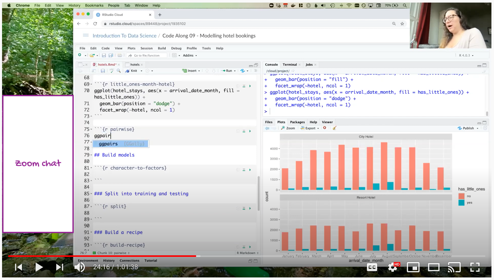

```{r child = "../setup.Rmd"}
```

```{r load-packages, message = FALSE, echo = FALSE}
library(magick)
library(tidyverse)
```

class: inverse, middle

# Why?

---

## Why livecode?

- Slows you down

--
- Helps you articulate each step

--
- Allows you to demonstrate the order and process

--
- (Most likely) causes you to make errors (that you can turn into teachable moments or use to show everyone makes errors!)

--
- Saves you time

---

## Why not *just* livecode?

- Providing multiple formats to learn from is better than just providing one

--
- Can be hard to follow if you're not careful

--
- Can be difficult to get a permanent record of (though this is less of a problem for virtual teaching)

---

class: inverse, middle

# What?

---

## Live code or not to live code

Any topic will benefit from a livecoding session, but for some using live coding as the **primary** communication method is more appropriate than others.

--

- Live code first:
  - RStudio IDE
  - Working with Git and GitHub
  - Using R Markdown

--

- Static materials first, live code second:
  - Anything involving a new (to your learners) syntax/API (dplyr, ggplot2, etc.)
  - Anything involving interpreting results
  - etc.

---

class: inverse, middle

# How?

---

<iframe width="1200" height="530"  src="https://www.youtube.com/embed/Vacuk_kNOz8" frameborder="0" allow="accelerometer; autoplay; clipboard-write; encrypted-media; gyroscope; picture-in-picture" allowfullscreen></iframe>

---

<iframe width="1200" height="530" src="https://www.youtube.com/embed/T5FKByBEe0c" frameborder="0" allow="accelerometer; autoplay; clipboard-write; encrypted-media; gyroscope; picture-in-picture" allowfullscreen></iframe>

---

## Live coding in person

- **Keep in mind:**
  - Room size
  - Audience size
  - Your own setup
  
- **Tip:** Don't rely on just the physical screen, use a secondary method to get your code in front of students' eyes (e.g. `r emo::ji("package")` [livecode](https://github.com/rundel/livecode))

---

## Live coding virtually

- **Keep in mind:** Audience watching on smaller devices
  
- **Tips:**
  - Test audience experience in a test run
  - If you have a live audience, give them plenty of opportunity and simple tooling to participate (e.g. Zoom chat)

---

## Virtual, live audience

```{r echo=FALSE, out.width="85%"}

```

---

## Virtual, prerecorded

```{r echo=FALSE, out.width="85%"}
knitr::include_graphics("images/prerecord.png")
```

---

## Live coding with strictly limited time

.hand[e.g. meetup presentations, conference talks, etc.]

<br>

**Tip:** Consider pre-recording a screencast that you can narrate during the event

---

## Livecoding pedagogy

- Build in delinerate fumbles and embrace your real mistakes

--
- Ask for predictions

--
- Take it slow

--
- Be seen and heard

--
- Mirror your learner's environment (then walk them through customisation)

--
- Use screen wisely

--
- Double devices (when possible)

--
- Go beyond the code: draw diagrams

--
- Improvise (particularly with a live audience)

.footnote[
.small[
Greg Wilson. [Teaching Tech Together: How to Make Your Lessons Work and Build a Teaching Community around Them](https://teachtogether.tech/). CRC Press, 2019.
]
]

---

## Livecoding tips

- Omit or fully narrate keyboard shortcuts

--
- If need to type passwords, keep "off screen" notes handy that you can copy-paste from

--
- Avoid switching between screens, disable notifications

```{r echo = FALSE}
knitr::include_graphics("images/shiny-livecode.jpeg")
```

