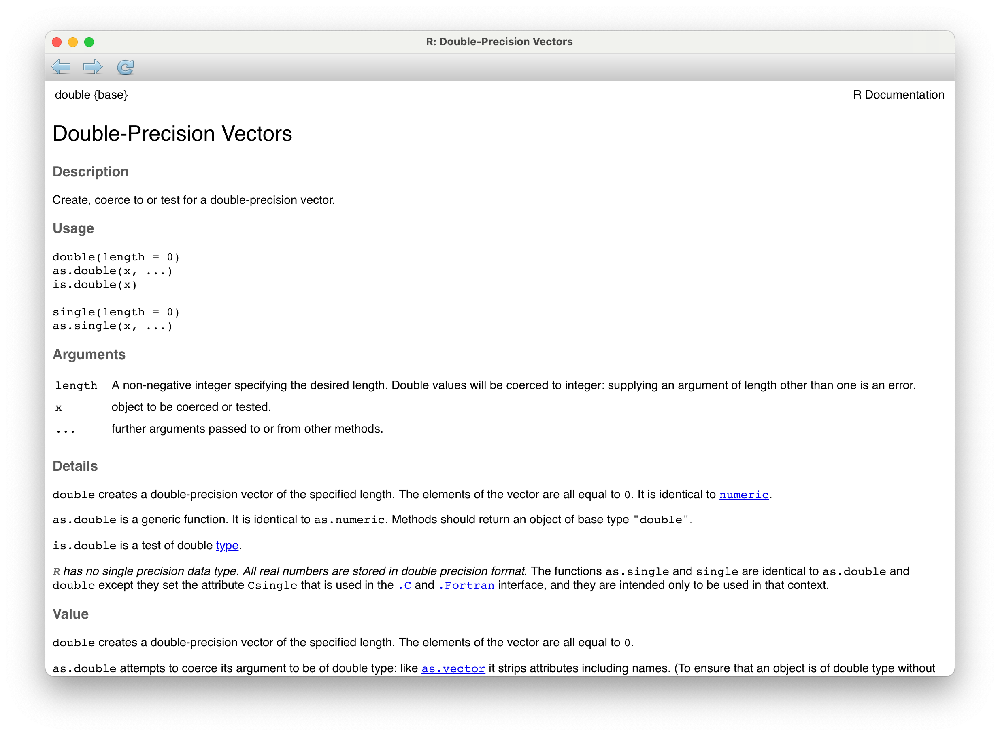
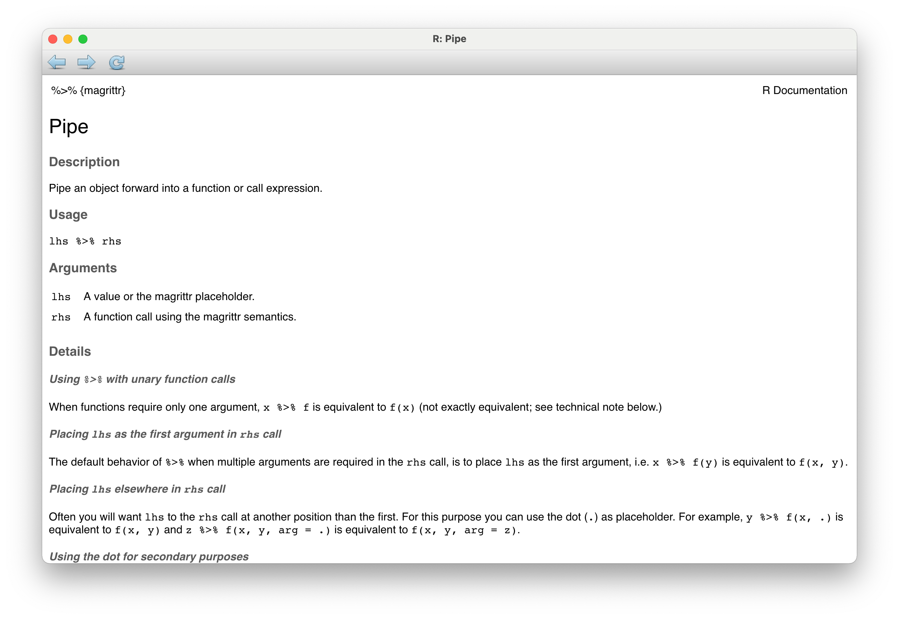

```{r child = "../setup.Rmd"}
```

class: inverse, middle

# Define

---

```{r eval = FALSE}
?double
```

```{r echo = FALSE, out.width = "70%"}

```

---

```{r eval = FALSE}
?`%>%`
```

```{r echo = FALSE, out.width = "70%"}

```

---

## Define terms

.hand[as relevant to your learners...]

- At the level of your audience (e.g. functional programming: formal definition vs. how `map()` works)

--

- In the context of your application (e.g. factors: how models handle them vs. why they're stored as integers internally)

---

class: inverse, middle

# Speak

---

## Read code and results out loud

.small[
```{r penguin-plot, fig.asp = 0.55}
ggplot(penguins, 
       mapping = aes(x = flipper_length_mm, y = body_mass_g, color = species, shape = species)) +
  geom_point() +
  labs(
    title = "Penguin size, Palmer Station LTER",
    subtitle = "Flipper length and body mass for Adelie, Chinstrap and Gentoo Penguins",
    x = "Flipper length (mm)", y = "Body mass (g)"
  )
```
]

---

## ggplot2 novellas vs. ggplot2 poems

.midi[
```{r eval=FALSE}
ggplot(penguins,mapping=aes(x=flipper_length_mm, y=body_mass_g, color=species, 
shape=species))+geom_point()+labs(title="Penguin size, Palmer Station LTER",
subtitle="Flipper length and body mass for Adelie, Chinstrap and Gentoo Penguins", 
x="Flipper length (mm)", y="Body mass (g)")
```
]

vs.

.midi[
```{r ref.label="penguin-plot", eval=FALSE}
```
]


