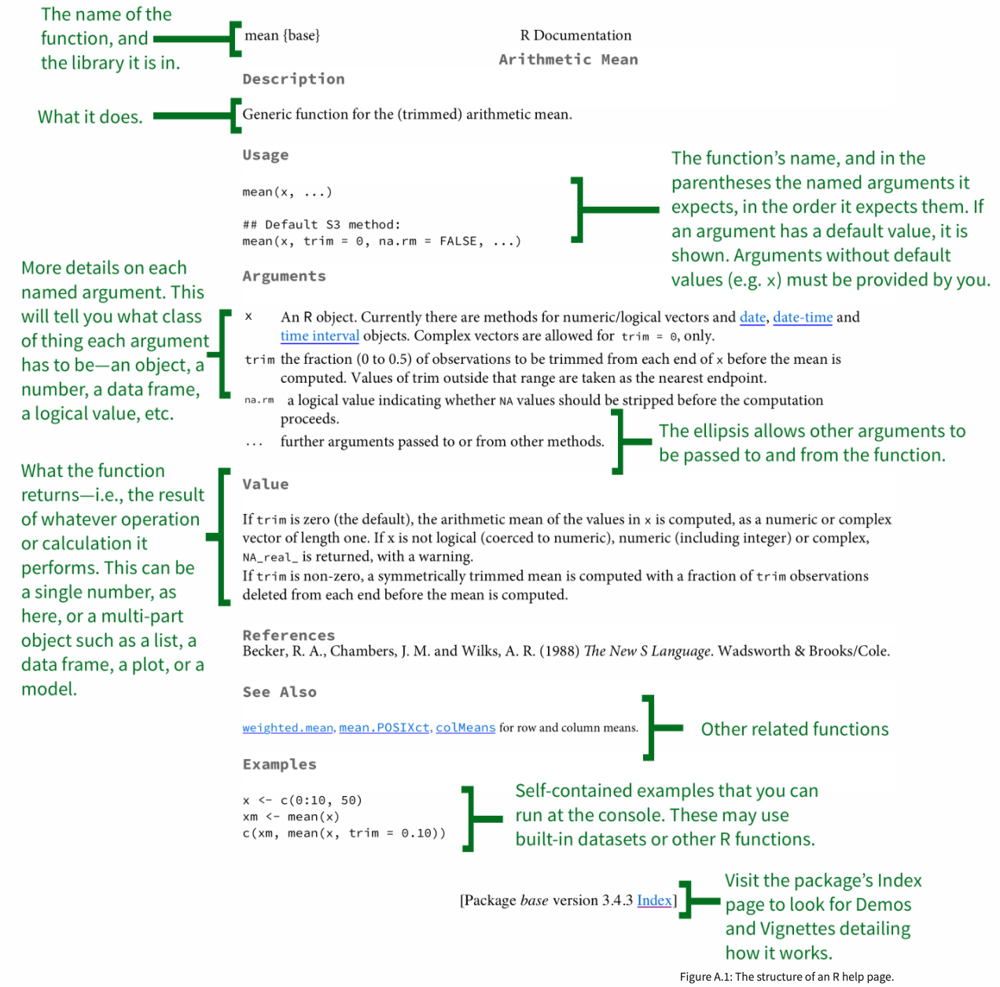
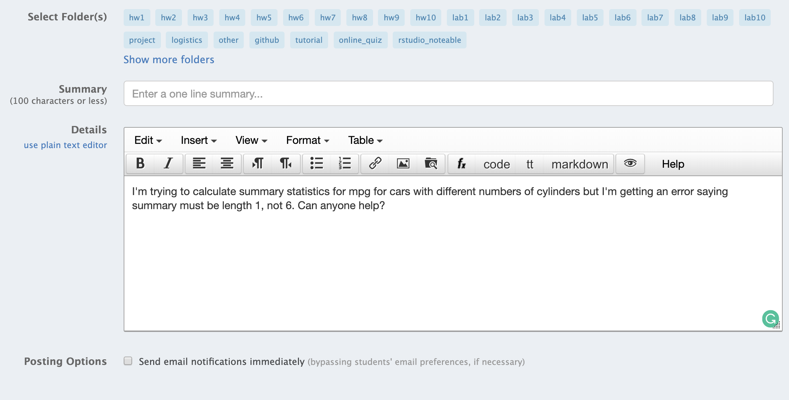

```{r child = "../setup.Rmd"}
```

```{r include=FALSE}
library(tidyverse)
```

## Help with `?help`

```{r out.width="50%", echo = FALSE}

```

.footnote[
.small[
https://socviz.co/appendix.html#a-little-more-about-r
]
]

---

## (Not so good) help with googling

<br>

.center[
<iframe width="840" height="473" src="https://www.youtube-nocookie.com/embed/6tw5uOth4AY" frameborder="0" allow="accelerometer; autoplay; clipboard-write; encrypted-media; gyroscope; picture-in-picture" allowfullscreen></iframe>
]

---

## (Better) help with googling

<br>

.center[
<iframe width="840" height="473" src="https://www.youtube-nocookie.com/embed/2sp2isnqoFU" frameborder="0" allow="accelerometer; autoplay; clipboard-write; encrypted-media; gyroscope; picture-in-picture" allowfullscreen></iframe>
]

---

## Packages designed for help

- `r emo::ji("package")` **[searcher](https://github.com/r-assist/searcher)** offers preliminary support for automatically or manually searching errors that are generated in R

- `r emo::ji("package")` **[reprex](https://reprex.tidyverse.org/)** helps prepare a minimal reproducible example by forcing forces students to fulfill the technical criteria so the instructor can focus on the help that only a human can provide

---

## searcher - search for a term

<br>

.center[
<iframe width="840" height="473" src="https://www.youtube-nocookie.com/embed/HtSiViKp3nk" frameborder="0" allow="accelerometer; autoplay; clipboard-write; encrypted-media; gyroscope; picture-in-picture" allowfullscreen></iframe>
]

---

## searcher - search for an error

<br>

.center[
<iframe width="840" height="473" src="https://www.youtube-nocookie.com/embed/krtUaS2zt9g" frameborder="0" allow="accelerometer; autoplay; clipboard-write; encrypted-media; gyroscope; picture-in-picture" allowfullscreen></iframe>
]

---

## A (not so great) question

```{r echo=FALSE, out.width="80%"}

```

---

## A much better question with reprex

<br>

.center[
<iframe width="840" height="473" src="https://www.youtube-nocookie.com/embed/uGcaAJ7ZWEk" frameborder="0" allow="accelerometer; autoplay; clipboard-write; encrypted-media; gyroscope; picture-in-picture" allowfullscreen></iframe>
]
