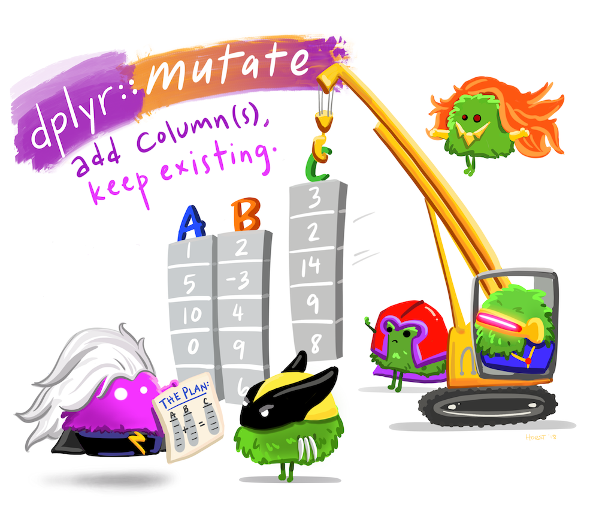

```{r child = "../setup.Rmd"}
```

## Welcoming first exposure

.pull-left[
```{r echo=FALSE, out.width="100%"}

```
]
.pull-right[
```{r echo=FALSE, out.width="100%"}

```
]

.footnote[
.small[
https://github.com/allisonhorst/stats-illustrations
]
]

---

## Visual explanations

```{r echo=FALSE, out.width="50%"}

```

.footnote[
.small[
https://twitter.com/hadleywickham/status/643381054758363136
]
]

---

## Visual incrementals

with [**xaringanExtra** panels](https://pkg.garrickadenbuie.com/xaringanExtra/#/panelset)

.center[
<iframe src="https://rstudio-education.github.io/datascience-box/course-materials/slides/u2-d02-ggplot2/u2-d02-ggplot2.html#7" width="672px" height="379px" allowfullscreen>
</iframe>
]

---

## Annotate, annotate, annotate

```{r echo=FALSE, out.width="80%"}
knitr::include_graphics("images/tour-r-rstudio.png")
```

---

## Think beyond the visual...

```{r echo=FALSE, out.width="30%"}

```

.footnote[
.small[
https://twitter.com/KStackWhitney/status/1143497505654677504
]
]
