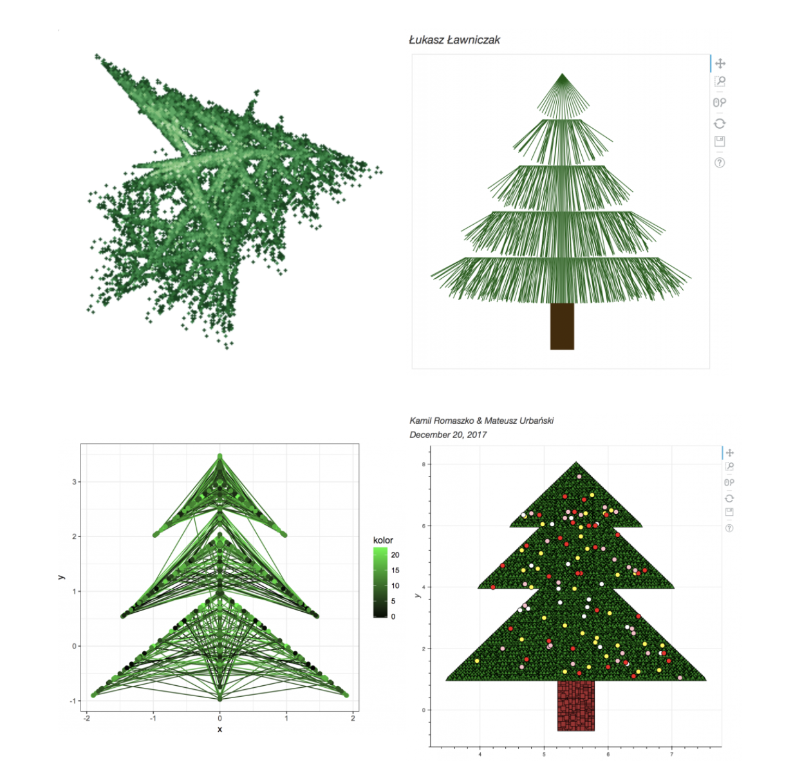
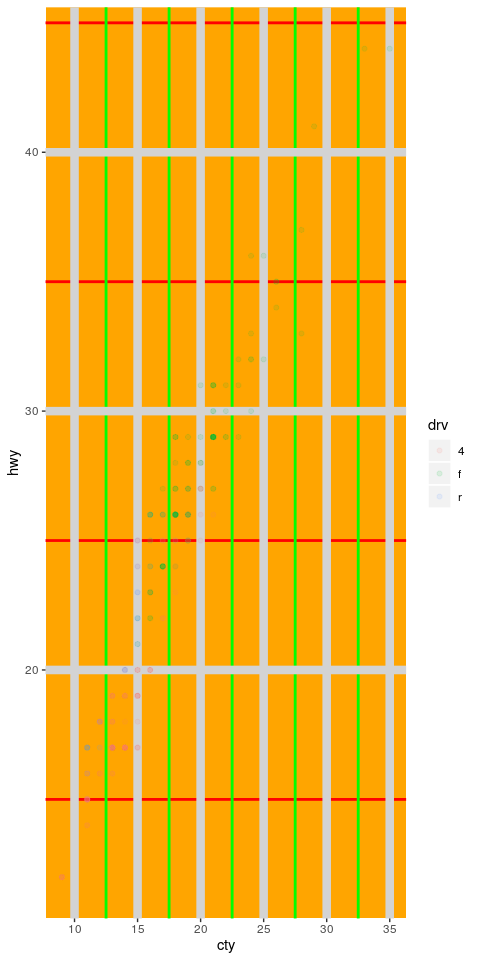
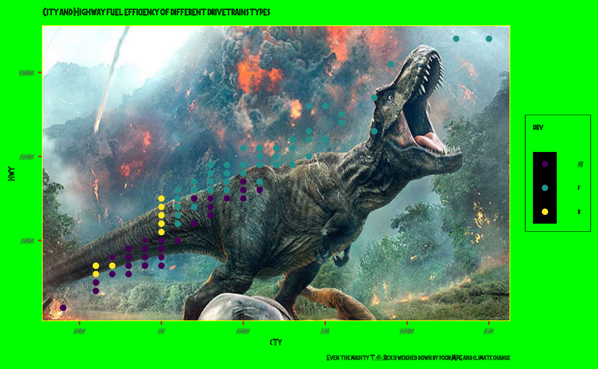

```{r child = "../setup.Rmd"}
```

class: inverse, middle

# Think big!

---

## Analyze your own data

>TL;DR  
>Pick a dataset, any dataset…  
>
>…and do something with it. That is your final project in a nutshell. More details below.  
>
>May be too long, but please do read  
>The final project for this class will consist of analysis on a dataset of your own choosing. The dataset may already exist, or you may collect your own data using a survey or by conducting an experiment. You can choose the data based on your interests or based on work in other courses or research projects. The goal of this project is for you to demonstrate proficiency in the techniques we have covered in this class (and beyond, if you like) and apply them to a novel dataset in a meaningful way.

---

class: inverse, middle

# Think smaller!

---

## Draw a christmas tree

```{r echo=FALSE, out.width = "45%"}

```

.footnote[
.small[
[smarterpoland.pl/index.php/2017/12/christmas-trees](http://smarterpoland.pl/index.php/2017/12/christmas-trees/)
]
]

---

## Make an ugly ggplot2

.pull-left[
```{r echo=FALSE, out.width="50%"}

```
]
.pull-right[
```{r echo=FALSE, out.width="100%"}

```
]
